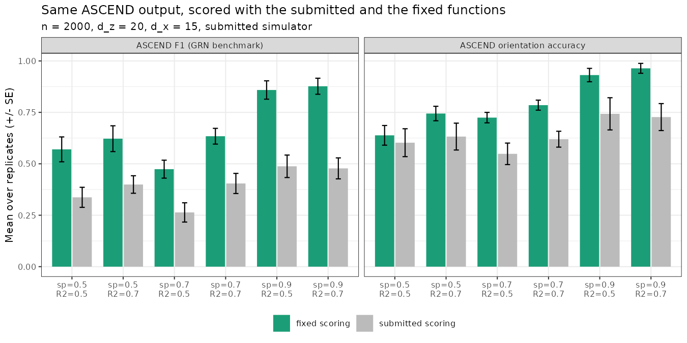
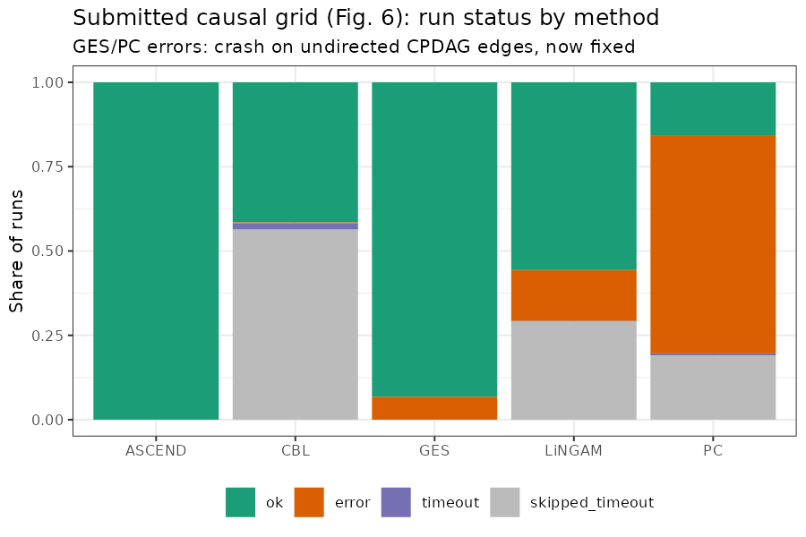
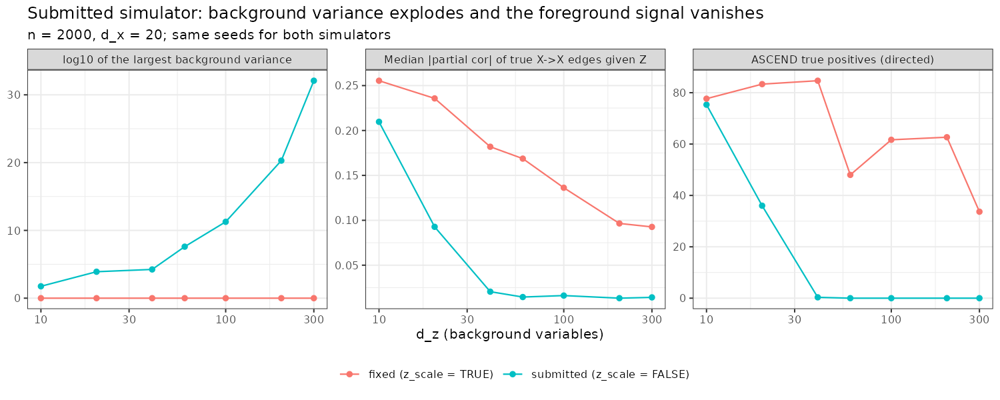
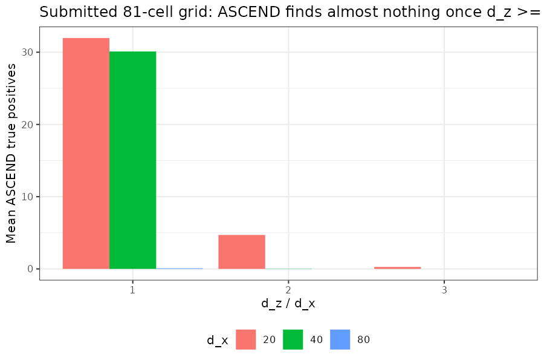
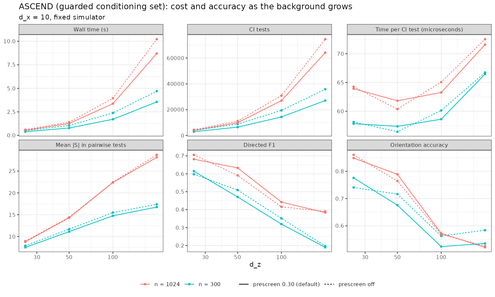
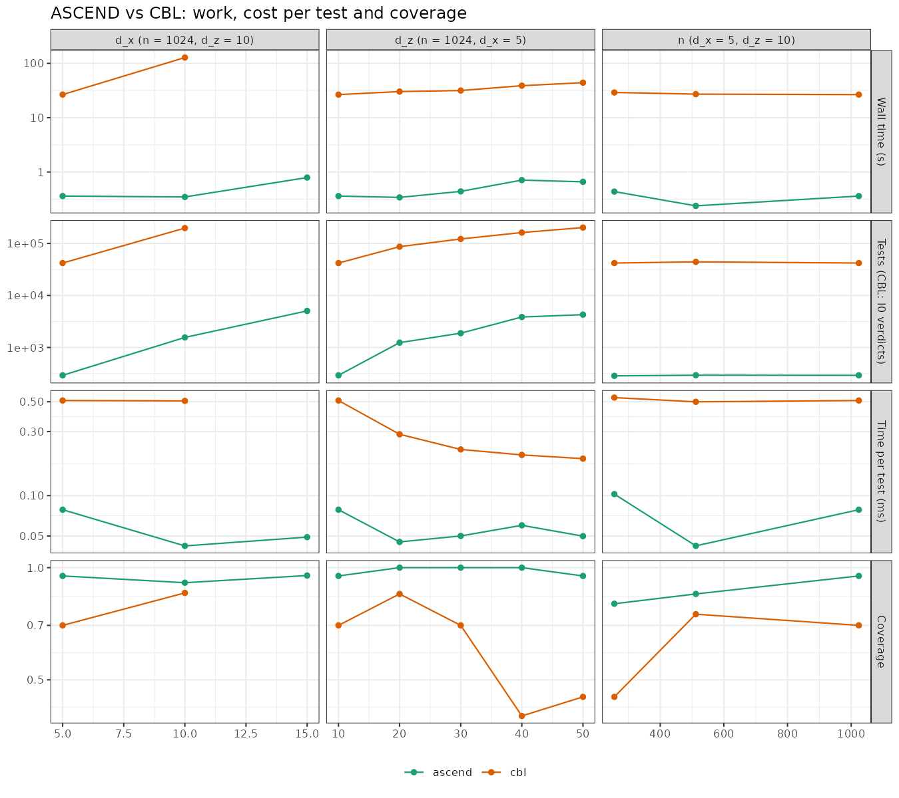
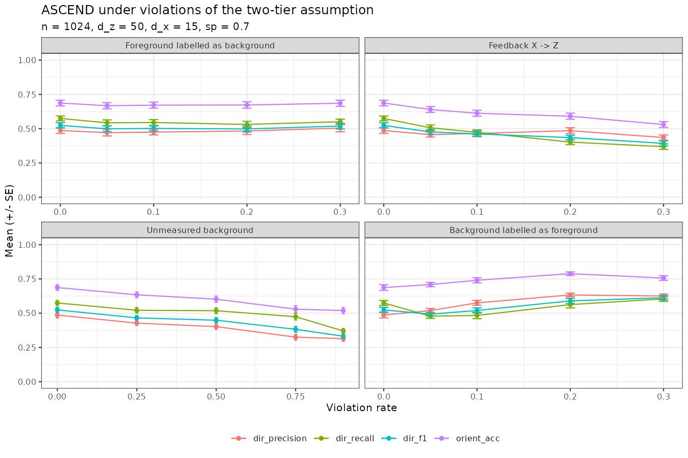
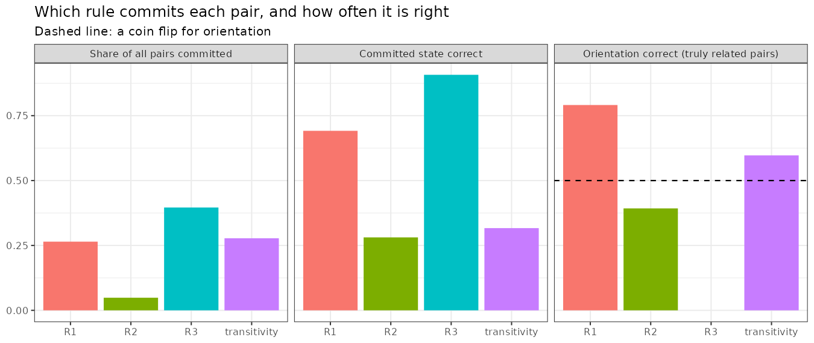
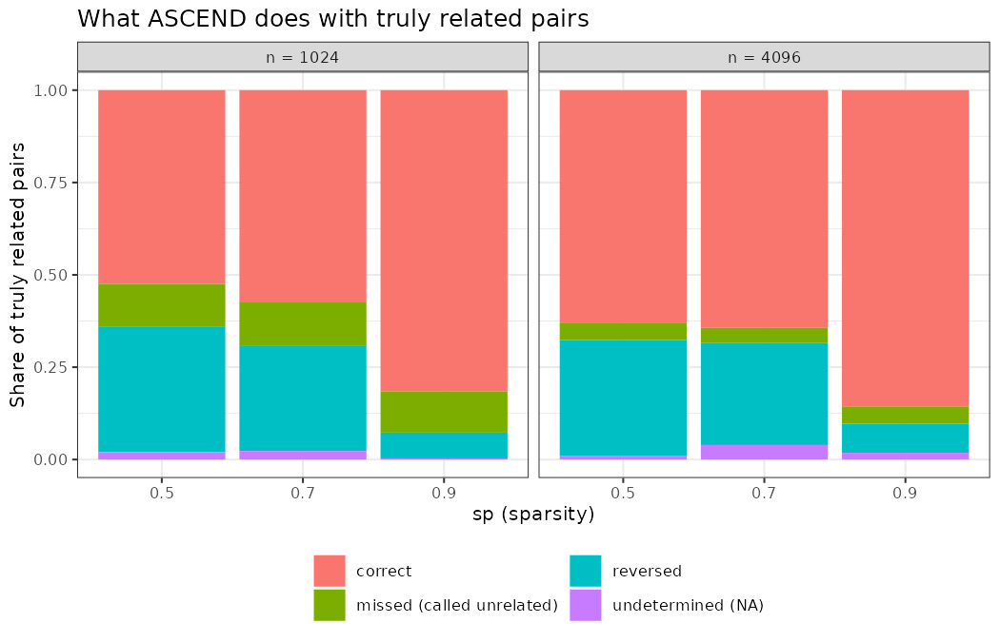
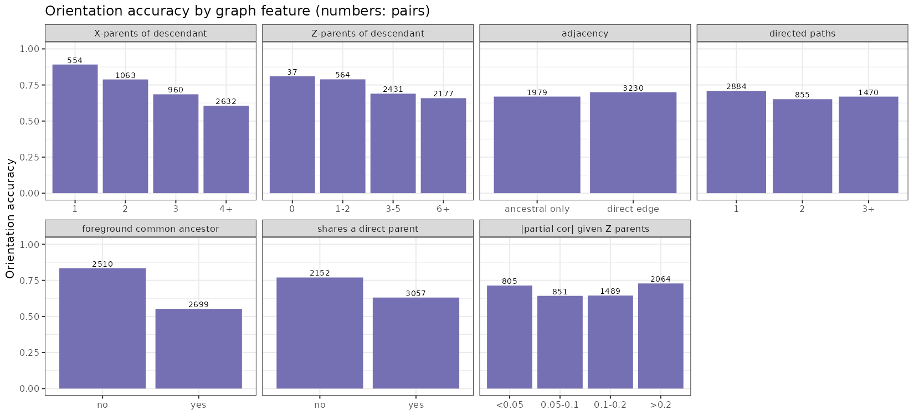

# Causal ASCEND: revision report (code and experiments)

Branch `revision/metrics-stats-ablation`, 28 September 2026.

This report covers the code and experiment side of the major revision. For each stage it gives:

- what was done and which reviewer comments it answers
- how to reproduce it yourself
- what came out
- what it means for the paper

Throughout, ASCEND uses its guarded conditioning set, which is the nearest-ancestor set: the union of the two endpoints' background Markov blankets, plus foreground variables already known to precede both. There is no other conditioning option in the code.

**About the numbers.** They come from pilot runs in a cloud container, with a few seeds and small grids. They are enough to see the direction of each effect. The paper's tables must come from the full re-runs on your cluster (section 8). Every pilot CSV is in `docs/pilot_results/`. Every figure is in `docs/figures/` and is redrawn by `analysis/make_report_figures.R`.

---

## Contents

0. [Summary](#0-summary)
1. [Audit of the submitted benchmark code](#1-audit-of-the-submitted-benchmark-code)
2. [The simulator fix](#2-the-simulator-fix)
3. [Shared metrics and paired statistics](#3-shared-metrics-and-paired-statistics)
4. [What ASCEND costs: tests, cost per test, scaling](#4-what-ascend-costs-tests-cost-per-test-scaling)
5. [Violations of the two-tier assumption](#5-violations-of-the-two-tier-assumption)
6. [What drives orientation](#6-what-drives-orientation)
7. [The background prescreen](#7-the-background-prescreen)
8. [Re-running the benchmarks on the cluster](#8-re-running-the-benchmarks-on-the-cluster)
9. [Setup and tests](#9-setup-and-tests)
10. [The story: what helps ASCEND and what hurts it](#10-the-story-what-helps-ascend-and-what-hurts-it)
11. [Decisions needed from you](#11-decisions-needed-from-you)
12. [Reviewer comment tracker](#12-reviewer-comment-tracker)

---

## 0. Summary

| # | Finding | Effect on the paper |
|---|---|---|
| 1 | The GRN benchmark scored only one direction of ASCEND's claims. This roughly halved ASCEND's F1 and the edge budget the competitors got. | Tables 1–3 and Fig. 2 must be re-run. ASCEND's own F1 rises from about 0.26–0.49 to 0.47–0.88. |
| 2 | In the causal grid, GES and PC crashed whenever their CPDAG had an undirected edge. 81% of PC runs and 7% of GES runs were dropped as "errors". | Fig. 6 compared ASCEND against the easy subset of PC/GES runs. It must be re-run. |
| 3 | The simulator let background variances grow without bound (above 10^30 at d_z = 300). Once d_z reached about 60, the foreground signal disappeared, and ASCEND found almost no edges in two-thirds of the grid. | All simulations are re-run with unit-variance background. The claims that ASCEND "gets faster as d_z grows" and that conditioning sets "shrink with d_z" (Remark 4) were artefacts and must go. |
| 4 | ASCEND's cost per CI test stays flat, at about 45–60 µs, from d_z = 25 to 200. The number of tests grows with d_z, and over 90% of them are Markov-blanket searches. | Comment 6: the gain is cheap tests on small conditioning sets, not fewer tests. |
| 5 | Under tier violations, ASCEND degrades gradually. Unmeasured background hurts most, with F1 falling from 0.57 to 0.34 at 90% hidden. | Comment 4 has an honest, mostly reassuring answer. |
| 6 | Most orientation errors are reversals, not abstentions. R1 is reliable (80%). R2 is worse than a coin flip (38%). Transitivity is 61% accurate. Accuracy falls with in-degree and with foreground confounding. The symmetry rule never fires. | Comment 11 has a clear answer, but it exposes a weak rule (R2). |
| 7 | Switching off the prescreen helps in some cells and hurts in others. | No change of default is needed. Report it as a sensitivity analysis. |
| 8 | Two comparators were read the wrong way round. pcalg's `as(fit, "amat")` stores the graph transposed, so every PC orientation in the causal grid was scored reversed. CBL returns `m[descendant, ancestor]`, so every CBL orientation in the causal grid and in the ASCEND-vs-CBL benchmark was scored reversed too. | Both are fixed and covered by tests (`tests/test_grn_multi.R`). PC's and CBL's direction metrics must come from the re-run. Their skeleton metrics, coverage and run times were not affected. |
| 9 | `eval_ancestral()` returned F1 = NA, not 0, when a method's claims were all wrong, which silently dropped those runs from averages. | F1 is now 2TP / (2TP + FP + FN). This only changes runs with no correct claim. |

**The story in one paragraph.** The fixes remove artefacts that were hurting ASCEND, namely one-sided scoring and a simulator that drowned the signal. The fixed ASCEND looks clearly better on the GRN benchmark than the submitted tables showed. But the fixes also remove two claims the paper leaned on: that ASCEND gets faster as the background grows, and that conditioning sets shrink. The defensible scalability story is narrower and still strong. Each test costs the same no matter how large the background is, because it conditions only on nearest ancestors. Total work grows roughly linearly with d_z, and ASCEND remains one to two orders of magnitude faster than CBL. On orientation, the paper should say plainly that ASCEND is excellent on sparse graphs (under 8% of true relations reversed at sp = 0.9). It is much weaker on dense graphs (23–34% reversed), mainly because of R2 and transitivity. Section 10 has the full account.

---

## 1. Audit of the submitted benchmark code

**Reviewer comments:** 1 (fair baselines), 2 (metrics), 9 (statistics).

### What was wrong

1. **GRN benchmark, ASCEND counted one way only** (`benchmarks/grn/run_grn_benchmark.R`).
   - `ascend_binary_skeleton()` and `ascend_score_matrix()` only read `M[i, j]` with i < j.
   - A claim that x_j is an ancestor of x_i (`M[j, i] = 1`, `M[i, j] = 0`) was therefore scored as "no edge".
   - About half of ASCEND's correct claims were thrown away. The number of ASCEND edges, K_match, was also used as the edge budget for GENIE3, ARACNe and WGCNA, so the competitors got half the budget too.
   - `ascend_direction_acc()` had the same restriction, and it also counted false-positive claims as wrong directions.
   - Both are fixed. The old functions are kept as `*_legacy` so the difference can be shown.
2. **Causal grid, GES and PC crashed on undirected edges** (`benchmarks/causal_grid/hpc_run.R`).
   - `cpdag_to_ancestral()` wrote `NA` into the matrix and then compared that cell with 0 on the mirror pair. R stops with "missing value where TRUE/FALSE needed" when this happens.
   - Every GES or PC estimate with an undirected edge not already oriented by a directed path was therefore recorded as `status = "error"`, and it was left out of the averages.
   - Undirected edges are now coded as related-but-unoriented, meaning 1 in both directions. `eval_ancestral()` scores these as "undirected".
   - This cause is inferred from the code and confirmed on a hand-built CPDAG in `tests/test_benchmark_smoke.R`. pcalg is not installed in the container, so no real PC or GES run was repeated here.
3. **Causal grid, orientation ignored.** The old `ancestral_metrics()` in `hpc_run.R` and `compute_shd()` in the CBL script read only the upper triangle in label order. Reversed orientations were never counted as errors. Both are replaced by the shared scorer (section 3).
4. **ASCEND's AUPR/AUROC came from a three-level score.** ASCEND is now also ranked by the p-value of its last pairwise test (`aupr_cont`, `auroc_cont`).

### How to reproduce

```bash
Rscript analysis/scoring_audit.R            # ~2 min, base R + data.table
Rscript analysis/make_report_figures.R      # redraws fig1 and fig1b
```

- Part A takes the submitted simulator and the GRN settings (n = 2000, d_z = 20, d_x = 15, all six (sp, R²) cells, 10 seeds). It runs ASCEND once and scores the same output with the submitted functions and with the fixed ones.
- Part B counts the run statuses in the submitted merged grid results.

### Results

The same ASCEND output, scored two ways (`docs/pilot_results/scoring_audit_grn.csv`):

| sp | R² | true edges | ASCEND edges, submitted | ASCEND edges, fixed | F1, submitted | F1, fixed | direction acc., submitted | orientation acc., fixed |
|---|---|---|---|---|---|---|---|---|
| 0.5 | 0.5 | 70.5 | 18.8 | 38.0 | 0.34 | 0.57 | 0.60 | 0.64 |
| 0.7 | 0.5 | 57.0 | 11.2 | 22.7 | 0.26 | 0.47 | 0.55 | 0.73 |
| 0.9 | 0.5 | 14.2 | 6.4 | 16.3 | 0.49 | 0.86 | 0.74 | 0.93 |
| 0.5 | 0.7 | 70.5 | 22.5 | 44.8 | 0.40 | 0.62 | 0.63 | 0.74 |
| 0.7 | 0.7 | 57.0 | 18.8 | 37.1 | 0.40 | 0.63 | 0.62 | 0.79 |
| 0.9 | 0.7 | 14.2 | 6.2 | 16.8 | 0.48 | 0.88 | 0.73 | 0.96 |



The submitted causal grid, runs by status (`scoring_audit_grid_status.csv`):

| method | ok | error | timeout | skipped (after a timeout) | error share |
|---|---|---|---|---|---|
| ASCEND | 11250 | 0 | 0 | 0 | 0% |
| CBL | 4670 | 30 | 214 | 6336 | 0.6% |
| GES | 10486 | 764 | 0 | 0 | 6.8% |
| LiNGAM | 6262 | 1696 | 27 | 3265 | 21% |
| PC | 1763 | 7277 | 75 | 2135 | 80.5% |



The LiNGAM errors have a different cause, which I have not found yet. LiNGAM does not go through `cpdag_to_ancestral()`. The re-run records the error message, so the cause will show up.

### What it means

- The submitted Tables 1–3 understate ASCEND's F1 by roughly a factor of 1.6–1.8.
- The competitors' F1 was computed at half the proper edge budget, so theirs will change too. Only the re-run can say whether the gap between ASCEND and the competitors grows or shrinks.
- The submitted comparison with PC in Fig. 6 used only about 20% of PC runs, and they were the easy ones, where PC oriented everything. A fair comparison needs the re-run. Reviewer 2 asked for exactly this kind of fairness (comment 1).

---

## 2. The simulator fix

**Reviewer comments:** the whole simulation section; 5 and 6 indirectly.

### What was wrong

In `sim_dat()`, every background variable was a sum of its background parents plus noise, and it was never rescaled. Along a chain of background parents the variance grows geometrically. The foreground variables load on the background with coefficients of ±1, so once d_z is large the background swamps the X → X signal. The partial correlation of a true foreground edge given Z then falls to the level of noise.

The fix is `sim_dat(..., z_scale = TRUE)`, which standardises each background variable as it is generated. It is your choice (decision card), and every revision script defaults to it (`Z_SCALE=1`). `z_scale = FALSE` reproduces the submitted data exactly, and `tests/test_ascend_regression.R` checks this.

### How to reproduce

```bash
Rscript analysis/simulator_diagnostic.R     # ~5 min; SEEDS=3 by default
```

It simulates both versions from the same seeds (n = 2000, d_x = 20) for d_z from 10 to 300. For each run it records:

- the largest background variance
- the median |partial correlation| of true X → X edges given Z
- ASCEND's true positives

It also reads the submitted grid and tabulates ASCEND's true positives by d_z / d_x.

### Results (3 seeds; `docs/pilot_results/simulator_diagnostic.csv`)

| d_z | max var(Z), submitted | median edge pcor, submitted | ASCEND TP, submitted | median edge pcor, fixed | ASCEND TP, fixed |
|---|---|---|---|---|---|
| 10 | 4.8 – 57 | 0.21 | 75 | 0.26 | 78 |
| 20 | 41 – 8,000 | 0.09 | 36 | 0.24 | 83 |
| 40 | 2,400 – 17,000 | 0.02 | 0.3 | 0.18 | 85 |
| 60 | 6·10^5 – 4·10^7 | 0.015 | 0 | 0.17 | 48 |
| 100 | 3·10^9 – 2·10^11 | 0.016 | 0 | 0.14 | 62 |
| 200 | 5·10^17 – 2·10^20 | 0.013 | 0 | 0.10 | 63 |
| 300 | 2·10^29 – 10^32 | 0.014 | 0 | 0.09 | 34 |



In the submitted 81-cell grid, ASCEND's mean true positives fall to about zero once d_z reaches about 60 (`submitted_grid_tp_by_dz.csv`, Fig. 2b). That happens in 6 of the 9 (d_x, d_z) combinations, and a seventh is already weak. Mean TP at d_x = 20 is 32, 4.7 and 0.3 for d_z = d_x, 2·d_x and 3·d_x. At d_x = 80 it is 0.08, 0.001 and 0.



### What it means

- Any submitted result at d_z ≳ 30 comes from data with no detectable foreground structure. That covers two-thirds of the grid, the d_z sweep in Fig. 5, and the runtime scaling fits.
- The paper's "ASCEND gets faster as d_z grows (t ∝ d_z^−0.45)" and Remark 4 ("s̄ shrinks with d_z") both describe an algorithm that finds nothing and stops early. With the fixed simulator both go the other way (section 4).
- These claims must be removed. The good news is that with the fixed simulator ASCEND finds real structure at every d_z tested.

---

## 3. Shared metrics and paired statistics

**Reviewer comments:** 2, 9, 11 (undetermined rate), minor 5, minor 9.

### What was done

**`R/eval_metrics.R`** is the one scorer every benchmark now uses. `eval_ancestral(est, truth)` classifies each unordered pair. The truth is a<b, b<a or none. The estimate is a<b, b<a, none, undirected or unresolved. From this it returns:

- `dir_precision`, `dir_recall`, `dir_f1`: directed metrics over ordered pairs. A reversed claim is both a false positive and a false negative.
- `orient_acc`: among pairs that are truly related and that the method calls related, the share oriented correctly.
- `orient_undet`: the share of such pairs left undirected or unresolved.
- `ad_acc`: 3-class ancestor/descendant/unrelated accuracy.
- `shd`: structural Hamming distance on the ancestral graph (reversal = 1, undirected on a true relation = 1); `shd_resolved` counts only resolved pairs.
- `coverage`: the share of pairs the method resolves (minor 9 asks for this definition).
- `skel_*`: undirected skeleton metrics, for methods without orientation.

`eval_undirected()` scores GENIE3/ARACNe/WGCNA skeletons against the same truth.

**`R/stats_utils.R`** provides the statistics:

- `paired_table()` gives, for every (cell, competitor, metric), the mean paired difference (ASCEND − competitor) with a 95% bootstrap CI and a t-interval, wins/ties/losses, and a two-sided paired Wilcoxon test.
- It applies BH correction within an explicitly named family. The default family is one per metric, containing every cell × competitor comparison, and the family and its size are written into the output.
- `summary_table()` gives mean ± SE for every metric, precision included.

This answers comment 9 ("mean differences with CIs, the comparison family, SE on precision") and minor 5.

**`analysis/revision_tables.R`** builds the tables:

- the GRN summary, with AUROC/AUPR in every cell
- a Table 2/3 replacement with paired CIs
- the coverage table
- ASCEND vs CBL compute cost
- runtime against discovered edges (minor 6)

Until the re-runs exist it uses the submitted CSVs.

### How to reproduce

```bash
Rscript tests/test_metrics.R           # hand-built graphs with known scores
Rscript analysis/revision_tables.R     # tables in analysis/out/
```

### What it means

Every method is now scored by the same definitions, and reversals count as errors. Once the re-run results exist, the tables will carry uncertainty and a stated multiple-testing family.

---

## 4. What ASCEND costs: tests, cost per test, scaling

**Reviewer comments:** 6 (separate the number of tests from their cost), 5 (complexity, empirical side), minor 6 (runtime vs edges).

### What was done

`ascend()` now counts its work and returns it as `attr(M, "stats")`:

- CI tests split into pairwise R3 tests, R1/R2 witness tests and Markov-blanket (IAMB) tests
- time spent inside the CI test
- mean and largest conditioning-set sizes
- the number of sweeps

Markov blankets are cached: IAMB is skipped for a variable whose candidate pool has not changed. The output is identical (checked in `tests/test_ascend_regression.R`), and the number of tests roughly halves. `benchmarks/cbl/run_ascend_vs_cbl.R` records the same quantities for CBL. It counts one "test" per ℓ0 lasso verdict on a feature, which is the closest analogue CBL has.

### How to reproduce

```bash
Rscript analysis/prescreen_scaling.R                      # ~10 min; ASCEND alone, d_z 25..200
BENCH_QUICK=1 Rscript benchmarks/cbl/run_ascend_vs_cbl.R  # smoke test (~2 min)
Rscript benchmarks/cbl/run_ascend_vs_cbl.R                # full sweep (hours; resumable)
Rscript analysis/make_report_figures.R                    # fig3, fig4
```

### Results

ASCEND alone, n = 1024, d_x = 10, default prescreen, 5 seeds (`prescreen_scaling.csv`):

| d_z | wall time (s) | CI tests | share that are blanket tests | time per test (µs) | mean \|S\| in pairwise tests | largest \|S\| |
|---|---|---|---|---|---|---|
| 25 | 0.41 | 3,752 | 73% | 50 | 8.1 | 12.8 |
| 50 | 0.89 | 9,408 | 88% | 46 | 13.1 | 20.0 |
| 100 | 2.85 | 28,262 | 95% | 52 | 21.9 | 28.6 |
| 200 | 7.06 | 66,498 | 97% | 58 | 29.3 | 38.4 |

- A log–log fit gives wall time ∝ d_z^1.4 at n = 1024 and ∝ d_z^1.0 at n = 300.
- The number of pairwise tests stays constant at about 48.



ASCEND vs CBL, n = 1024, d_x = 5, 2 seeds (partial pilot, `docs/pilot_results/results_ascend_vs_cbl_v2.csv`; the d_x sweep was still running):

| d_z | ASCEND time (s) | CBL time (s) | ASCEND tests | CBL ℓ0 verdicts | ASCEND time per test | CBL time per verdict |
|---|---|---|---|---|---|---|
| 30 | 0.44 | 31.6 | 1,883 | 122,000 | 50 µs | 0.22 ms |
| 40 | 0.71 | 38.8 | 3,852 | 162,000 | 60 µs | 0.20 ms |
| 50 | 0.66 | 44.1 | 4,276 | 202,000 | 50 µs | 0.19 ms |



### What it means for comment 6

- **The cost of one test is flat.** ASCEND conditions only on the nearest ancestors of the two endpoints. The conditioning set grows slowly (8 → 29 variables while d_z grows 8-fold), and each Fisher-z test reuses one correlation matrix. So each test costs about the same (45–60 µs) at every background size. This is the mechanism the reviewer asked us to isolate.
- **The number of tests grows**, roughly linearly with d_z. Almost all the growth is in the Markov-blanket searches. The pairwise tests that decide the foreground relations do not grow at all. The paper should not claim that ASCEND runs fewer tests because of its conditioning set. It should say that ASCEND keeps each test small and cheap, and that the background enters only through blanket searches.
- **Smaller conditioning sets also mean more power** for a fixed n. A partial correlation given 10 variables is estimated with n − 13 degrees of freedom, not n − d_z − 3. This is the finite-sample argument for nearest-ancestor conditioning. It is a theoretical point the paper can make; I have not written a separate experiment for it.
- **ASCEND against CBL.** ASCEND also resolves more pairs: its coverage is 0.95–1.0, against 0.4–0.9 for CBL (fig4, bottom row). On speed, ASCEND is 50–70 times faster. Its tests are about 4 times cheaper than a CBL ℓ0 verdict, and it runs far fewer of them. The units differ (a Fisher-z test against a lasso verdict per feature), so the paper should present the two components side by side rather than as one ratio.
- **Remark 4 and the runtime exponent** must be rewritten: conditioning sets grow sub-linearly with d_z, and runtime grows about linearly.

---

## 5. Violations of the two-tier assumption

**Reviewer comment:** 4 (tier misassignment, incomplete tiers, feedback).

### What was done

`R/sim_tiers.R` simulates one joint DAG over all variables. The analyst then sees the variables through a tier labelling that can be wrong in four ways:

- `p_x_as_z`: foreground variables labelled as background. These have foreground parents, so the tier assumption is violated.
- `p_feedback`: background variables caused by a foreground variable (X → Z). Violated.
- `p_hide_z`: background variables not measured. This is an incomplete tier and gives latent confounding.
- `p_z_as_x`: background variables labelled as foreground. The assumption still holds, but there are fewer anchors.

The truth is always computed on the full joint DAG, so paths through hidden or mislabelled variables count.

### How to reproduce

```bash
Rscript tests/test_sim_tiers.R
Rscript analysis/tier_sensitivity.R            # 10 seeds, ~30 min; SEEDS=3 for a quick look
Rscript analysis/make_report_figures.R         # fig5
```

The settings are n = 1024, d_z = 50, d_x = 15, sp = 0.7, R² = 0.5.

### Results (10 seeds per level; `tier_sensitivity_summary.csv`)

| violation | rate | directed precision | directed recall | directed F1 | orientation acc. |
|---|---|---|---|---|---|
| none | 0 | 0.53 | 0.61 | 0.57 | 0.73 |
| foreground labelled as background | 0.10 / 0.30 | 0.47 / 0.49 | 0.54 / 0.51 | 0.49 / 0.49 | 0.68 / 0.67 |
| feedback X → Z | 0.10 / 0.30 | 0.48 / 0.49 | 0.49 / 0.44 | 0.48 / 0.47 | 0.64 / 0.60 |
| unmeasured background | 0.50 / 0.90 | 0.45 / 0.32 | 0.56 / 0.38 | 0.49 / 0.34 | 0.64 / 0.52 |
| background labelled as foreground | 0.10 / 0.30 | 0.56 / 0.60 | 0.46 / 0.59 | 0.49 / 0.60 | 0.72 / 0.74 |



### What it means

- **Graceful degradation.** At 10–30% mislabelling or feedback, F1 drops by 0.07–0.10 and then levels off. There is no cliff.
- **Unmeasured background hurts most.** It is latent confounding, and ASCEND has no mechanism for it. Losing half the background costs 0.08 F1. Losing 90% costs 0.23, and orientation falls to near chance (0.52). This belongs in the limitations section (minor 8).
- **Background labelled as foreground is nearly harmless.** It adds pairs but keeps the order valid.
- **Feedback mostly costs recall**, because a Z caused by X blocks the orientation witnesses ASCEND relies on.

---

## 6. What drives orientation

**Reviewer comment:** 11 (which rules drive orientation, how often it is undetermined, how it depends on parents, confounders and faithfulness).

### What was done

`ascend()` now records, for every pair:

- which step committed it (R1, R2, R3, transitivity, symmetry or final R3), as `attr(M, "rule")`
- in which sweep, as `"rule_sweep"`
- how many independent witnesses agreed, as `"rule_votes"`

`analysis/orientation_analysis.R` joins this with features of the true graph:

- the in-degree of the descendant
- whether the pair shares a direct parent
- whether a foreground common ancestor reaches both
- the number of directed paths
- adjacency
- the |partial correlation| given the true background parents, as a proxy for near-unfaithfulness

### How to reproduce

```bash
Rscript analysis/orientation_analysis.R        # 20 seeds default (report: 10); SEEDS=5 quick
Rscript analysis/make_report_figures.R         # fig6, fig6b, fig6c
```

The grid is n ∈ {1024, 4096} × sp ∈ {0.5, 0.7, 0.9}, with d_z = 50 and d_x = 15.

### Results (10 seeds × 6 cells, 6,300 pairs)

Which step commits each pair:

| step | share of pairs | committed state correct | orientation correct (truly related) | median witnesses |
|---|---|---|---|---|
| R3 (independence → unrelated) | 40% | 91% | — | — |
| R1 (deactivation → ancestor) | 27% | 70% | **80%** | 2 |
| transitivity | 27% | 34% | 61% | — |
| R2 (activation → not a descendant) | 5% | 28% | **38%** | 1 |
| unresolved | 1% | — | — | — |
| symmetry | **0%** | — | — | — |



What happens to truly related pairs (pooled): 63% are oriented correctly, 27% are reversed, 8% are called unrelated, and 2% are left undetermined. Reversals depend strongly on density:

| | sp = 0.5 | sp = 0.7 | sp = 0.9 |
|---|---|---|---|
| reversed, n = 1024 | 34% | 23% | 5% |
| reversed, n = 4096 | 30% | 28% | 8% |



Orientation accuracy by feature (truly related and oriented pairs):

| feature | accuracy |
|---|---|
| descendant has 1 / 2 / 3 / 4+ foreground parents | 92% / 78% / 65% / 64% |
| a foreground common ancestor reaches both: no / yes | 84% / 58% |
| share a direct parent: no / yes | 78% / 64% |
| direct edge / ancestral only | 71% / 68% |
| \|partial cor\| < 0.05 / > 0.2 | 70% / 75% |



### What it means

- **ASCEND's errors are confident reversals, not abstentions.** Only 2% of true relations are left undetermined, so the undetermined rate the reviewer asked about is low, but the reversal rate in dense graphs is high.
- **R1 carries the orientation and is reliable** (80%, usually with two agreeing witnesses).
- **R2 is below chance** (38%). It usually fires on a single witness, and in dense graphs a foreground confounder can mimic an activation.
- **Transitivity passes on errors.** It is only as good as the claims it chains (61%).
- **Accuracy falls with the descendant's in-degree and with foreground confounding.** This is the reviewer's "dependence on parents and confounders", now quantified.
- **Near-unfaithfulness is not the main problem.** Weak partial correlations are not much worse than strong ones.
- **The symmetry rule in the paper never fires in the code.** R2 records its claim as (0.5, 0), and a pair is never revisited once committed, so the condition symmetry needs never occurs. Either the paper drops the rule, or the code changes how R2 is stored. That is decision 2 in section 11.

---

## 7. The background prescreen

**Reviewer comments:** 4 (a strict prescreen behaves like unmeasured background) and 5.

### What was done

Before the Markov-blanket search, ASCEND drops background variables whose marginal association with a foreground variable has BH p > 0.30. At large d_z this can drop weak true ancestors. `analysis/prescreen_scaling.R` runs every setting with the default `prescreen = 0.30` and with the prescreen off (`prescreen = 1`).

### How to reproduce

```bash
Rscript analysis/prescreen_scaling.R           # same run as section 4
```

### Results (directed F1, 5 seeds)

| n | d_z | prescreen 0.30 | prescreen off |
|---|---|---|---|
| 300 | 50 | 0.47 | 0.61 |
| 300 | 100 | 0.33 | 0.31 |
| 1024 | 25 | 0.62 | 0.63 |
| 1024 | 50 | 0.79 | 0.69 |
| 1024 | 100 | 0.48 | 0.42 |
| 1024 | 200 | 0.33 | 0.46 |

Switching the prescreen off costs 5–35% more time.

### What it means

Neither setting wins everywhere. The prescreen helps in the middle range and hurts at n = 300, d_z = 50 and n = 1024, d_z = 200. I suggest keeping the default and reporting this table as a sensitivity analysis. The prescreen is also the likely reason F1 dipped at n = 1024, d_z = 200 in your own local run.

---

## 8. Re-running the benchmarks on the cluster

Every benchmark now uses the fixed simulator (`Z_SCALE=1`), the shared scorer and the fixed scoring. Results go to new files, so the submitted results in `benchmarks/*/results_submitted/` are never overwritten.

| benchmark | paper | command | output |
|---|---|---|---|
| GRN | Tables 1–3, Fig. 2 | `Rscript benchmarks/grn/run_grn_benchmark.R` | `benchmarks/grn/results/benchmark_v3_*.csv` |
| GRN (quick) | | `GRN_QUICK=1 N_REP=3 Rscript benchmarks/grn/run_grn_benchmark.R` | same |
| ASCEND vs CBL | Fig. 5 | `Rscript benchmarks/cbl/run_ascend_vs_cbl.R` (resumable) | `benchmarks/cbl/results/results_ascend_vs_cbl_v2.csv` |
| causal grid | Fig. 6 | `cd benchmarks/causal_grid && bash submit_all.sh` | `results/job_*/`, then `Rscript hpc_merge.R` → `ascend_benchmark_v3_merged.csv` |
| causal grid (one task) | | `N_REP=2 METHOD_TIMEOUT=300 Rscript benchmarks/causal_grid/hpc_run.R 1` | same |
| **multi-method GRN benchmark** (comments 1, 2, 3, 9, 11) | Tables 2–3, Fig. 2, SERGIO table | `bash benchmarks/grn_multi/slurm/setup.sh`, `sbatch benchmarks/grn_multi/slurm/test_pipeline.sbatch`, then `bash benchmarks/grn_multi/slurm/submit_all.sh` | `$GRNM_WORK/results/` (see `benchmarks/grn_multi/README.md`) |
| tables | | `Rscript analysis/revision_tables.R` | `analysis/out/` |
| figures | | `Rscript analysis/make_report_figures.R` | `docs/figures/` |
| Fig. 2 heatmap | | `Rscript benchmarks/grn/plot_f1_heatmap.R` | `benchmarks/grn/results/` |
| Fig. 5 | | `python3 benchmarks/cbl/plot_ascend_vs_cbl.py <csv> <outdir>` | |

- On the cluster, `submit.sh` runs `hpc_run.R` from `benchmarks/causal_grid/`. `hpc_run.R` finds `R/ascend.R`, `R/cbl.R` and `R/eval_metrics.R` by itself, so there is no longer any need to copy files next to it.
- `cbl.R` reads the core count from `N_CORES` (default 16, as before).

**What stays the same:**

- ASCEND's algorithm, with the same output on the same data
- the CI test (Fisher-z), IAMB, rules R1–R3 and closure
- the parameter grids, seeds and SLURM scripts
- the competitor wrappers

---

## 9. Setup and tests

R ≥ 4.3.

```r
install.packages(c("data.table", "dplyr", "tidyverse", "igraph", "matrixStats", "R.utils",
                   "glmnet", "lightgbm", "doParallel", "foreach", "PRROC", "bnlearn",
                   "WGCNA", "doMC", "ggplot2"))
install.packages("BiocManager"); BiocManager::install(c("graph", "RBGL", "GENIE3", "minet"))
install.packages("pcalg")
```

The tests need base R only, plus data.table, dplyr and R.utils for the smoke test. Run them from the repository root:

| test | checks | time |
|---|---|---|
| `Rscript tests/test_metrics.R` | the scorer and the paired statistics give the known answers on hand-built graphs | < 5 s |
| `Rscript tests/test_sim_tiers.R` | each violation type does what it says; truth matches the DAG | < 5 s |
| `Rscript tests/test_ascend_regression.R` | revised `ascend()` = submitted `ascend()` (frozen copy in `tests/fixtures/`); provenance and work counters are consistent; `z_scale` gives unit variance | ~30 s |
| `Rscript tests/test_benchmark_smoke.R` | the GRN and causal-grid scoring pipelines run end to end with stand-in competitors; undirected CPDAG edges are scored as undirected | ~1 min |

All four pass in the cloud container.

---

## 10. The story: what helps ASCEND and what hurts it

### What helps

1. **ASCEND was under-reported.** The GRN scoring bug discarded about half of ASCEND's correct claims. On the same output, fixed scoring gives F1 0.47–0.88, against 0.26–0.49 as submitted. Orientation accuracy rises from 0.55–0.74 to 0.64–0.96. Whether ASCEND's lead over GENIE3/ARACNe/WGCNA widens depends on the re-run, because they also get a larger edge budget. ASCEND's own numbers only go up.
2. **The simulator fix removes an embarrassing collapse.** In the submitted grid ASCEND found almost nothing in two-thirds of the cells. With the fixed simulator it still finds real structure at d_z = 300, although accuracy falls as the background grows (directed F1 0.58 at d_z = 10, 0.45 at 200, 0.28 at 300). A reviewer who looked closely at those cells would have found the collapse.
3. **The scalability story survives in a cleaner form.** Each test costs the same regardless of background size, the conditioning sets stay small, and ASCEND is 50–70 times faster than CBL. That is a direct, mechanistic answer to comment 6.
4. **ASCEND is robust to most tier errors.** Mislabelling and feedback cost about 0.1 F1, with no cliff. Comment 4 is answered with evidence, not argument.
5. **Orientation on sparse graphs is excellent.** Orientation accuracy is 93–96% at sp = 0.9 in the GRN setting, and under 8% of true relations are reversed in the orientation analysis. Gene networks are usually sparse, which supports the biological use case.
6. **The comparison with PC/GES will now be fair.** The paper will no longer rest on 20% of PC runs, and reviewers will see that.

### What hurts

1. **Two headline scalability claims were artefacts.** "ASCEND gets faster as d_z grows" and "s̄ shrinks with d_z" (Remark 4) must go. Runtime grows about linearly in d_z, and conditioning sets grow sub-linearly. This is still good, but it is a weaker claim than the submitted one.
2. **The "fewer tests" framing does not hold.** ASCEND's test count grows with d_z because of blanket searches. The argument has to be cost per test and statistical power, not test count.
3. **Dense graphs expose orientation weaknesses.** 23–34% of true relations are reversed at sp = 0.5–0.7. R2 is below chance and transitivity propagates errors. The paper must report this. Requiring two witnesses for R2 may fix part of it (decision 1).
4. **Latent background confounding is a real limitation.** With 90% of the background unmeasured, F1 falls to 0.34 and orientation to chance. This belongs in the limitations section.
5. **Paper and code disagree on the symmetry rule**, and the paper says F-test where the code uses Fisher-z. Both are small, but a careful reviewer can check them.
6. **All simulation numbers will change.** Every table and figure from simulation needs the cluster re-run. The real-data analyses (comments 7, 8) have not been touched yet.

### Net assessment

The revision does not destroy the ASCEND story, but it changes its emphasis.

- **Old version:** "scales better, and gets faster, as the background grows."
- **New version:** "keeps each test local and cheap, so it stays practical when the background is large. It orients sparse regulatory structure reliably. It degrades gracefully when the tier assumption is bent."

The new version is better defended and harder for a reviewer to break. The weak points (R2, dense graphs, latent confounding) are ones the paper can state openly as limitations, with numbers.

---

## 11. Decisions needed from you

1. **R2 with at least two witnesses?** R2 is 38% accurate and usually fires on one witness. Requiring two would change ASCEND's output, so I have not done it. My recommendation is to try it as an option, compare, and decide.
2. **Symmetry rule.** Drop it from the paper, or change how R2 stores its claim so that the rule can fire. My recommendation is to drop it from the paper, because it never fires and changes nothing.
3. **Prescreen default.** Keep 0.30 and report the sensitivity table (my recommendation), or switch it off.

---

## 12. Reviewer comment tracker

| comment | status | where |
|---|---|---|
| 1 Baselines (CLR, MRNET, GRNBoost2, PIDC, deep, direction-aware) | code done, needs cluster run | `benchmarks/grn_multi/` (16 methods) |
| 2 AUROC/AUPR everywhere, oriented metrics, SHD | code done, needs re-run | `R/eval_metrics.R`, all benchmarks |
| 3 BEELINE alignment | code done (SERGIO DS1/DS2 arm, BEELINE metrics), needs cluster run | `benchmarks/grn_multi/py/make_sergio.py` |
| 4 Tier misassignment / incomplete / feedback | done (pilot, 10 seeds) | section 5 |
| 5 Complexity | empirical side done; the theorem is writing | section 4 |
| 6 Number of tests vs cost per test | done (pilot) | section 4 |
| 7 DGRP controls | not started; needs your DGRP files | `realdata/drosophila/` |
| 8 Yeast evaluation | not started; needs BFCS data | `realdata/yeast/` |
| 9 Paired differences, CIs, families, SE | code done, needs re-run | `R/stats_utils.R`, `analysis/revision_tables.R` |
| 10 Background-knowledge literature | writing | — |
| 11 Orientation drivers | done (pilot, 10 seeds) | section 6 |
| minor 5 Fig. 2 caption: F1 only | code gives the paired F1 table; caption is writing | `analysis/revision_tables.R` |
| minor 6 Runtime vs discovered edges | code done, needs re-run | fig7 |
| minor 9 Coverage definition and table | code done | `R/eval_metrics.R`, `coverage_table.csv` |
| minor 10 Is 99% coverage desirable? | not started | — |
| minors 1–4, 7, 8, 11, 12 | writing (minor 8 can use sections 5–6) | — |
